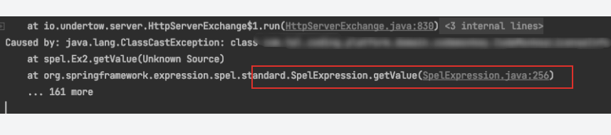

# 阿里的JetCache使用因为Spring DevTools引发类转换导致注解缓存不可用问题

## 项目中引入依赖说明

spring devtools、JetCache(version: 2.5.15)

## 报错信息

```text
Caused by: java.lang.ClassCastException: class xxxxx.App cannot be cast to class xxxxx.App (xxxxx.App is in unnamed module of loader org.springframework.boot.devtools.restart.classloader.RestartClassLoader @7d065827; xxxxx.App is in unnamed module of loader 'app')
at spel.Ex2.getValue(Unknown Source)
at org.springframework.expression.spel.standard.SpelExpression.getValue(SpelExpression.java:256)
... 157 more
```

## 启动时查看我的App对象

通过 app.getClass().getClassLoader() 查看是 RestartClassLoader
但是这里报错是因为使用AppClassLoader 加载的出现了问题

## 点击报错行进入源码调试



进入之后通过调试发现，当项目启动第一次或者第二次时没有问题，然后再获取缓存就出现类转换异常，导致el表达式模板转换错误

看源码这个代码

```java
public static Object evalKey(CacheInvokeContext context, CacheAnnoConfig cac) {
    String keyScript = cac.getKey();
    try {
        if (cac.getKeyEvaluator() == null) {
            if (CacheConsts.isUndefined(keyScript)) {
                cac.setKeyEvaluator(o -> {
                    CacheInvokeContext c = (CacheInvokeContext) o;
                    return c.getArgs() == null ? "_$JETCACHE_NULL_KEY$_" : c.getArgs();
                });
            } else {
                ExpressionEvaluator e = new ExpressionEvaluator(keyScript, cac.getDefineMethod());
                cac.setKeyEvaluator((o) -> e.apply(o));
            }
        }
        return cac.getKeyEvaluator().apply(context);
    } catch (Exception e) {
        logger.error("error occurs when eval key \"" + keyScript + "\" in " + context.getMethod() + ":" + e.getMessage(), e);
        return null;
    }
}
```

当解析el正常时，则会走 if (cac.getKeyEvaluator() == null) true分支

当解析el错误时，则会走 else 分支

通过初步判断为 第二次或者第三次走时，是有了某些缓存

进一步查看代码


是SpringEl表达式解析代码，会有一个缓存编译器的缓存操作

该问题在2.6版本后官方说是修复了，我测试下是可以了
具体沟通在这里
[https://github.com/alibaba/jetcache/issues/380](https://github.com/alibaba/jetcache/issues/380)
