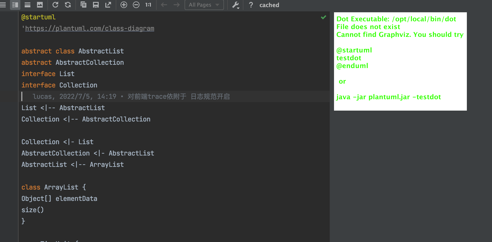

# PlantUML in Mac使用问题解决



## 解决

> 先下载 Graphviz，然后查看 dot 是否安装成功

### macos

```shell
brew install Graphviz
dot -version
```

然后把 dot二进制可执行文件 复制到 plantUML查找dot的位置
(好像不能从idea里配置。。。

```shell
sudo mkdir -p /opt/local/bin
sudo cp /opt/homebrew/Cellar/graphviz/2.49.3/bin/dot /opt/local/bin
```
